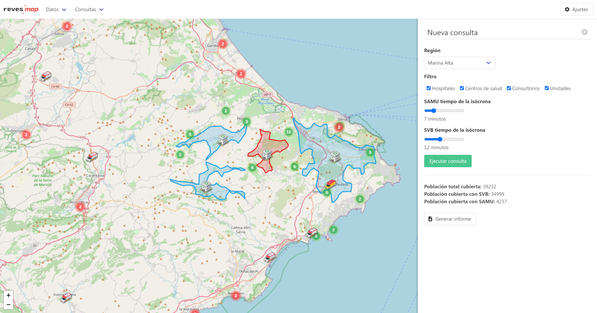

<h1 align="center">
    <br>
    
</h1>

Reves Map forma parte de [iReves](http://ireves.webs.upv.es/), una herramienta inteligente de ayuda a la toma de decisiones para la innovación en la Reubicación de Vehículos de Emergencias Sanitarias. Reves Map tiene como finalidad ayudar a visualizar fácilmente el impacto que las decisiones pueden tener sobre la cantidad de población que estaría cubierta ante una emergencia. Este repositorio contiene el código fuente del cliente web. Puedes acceder al repositorio del servidor desde [aquí](https://github.com/joancipria/ireves-map-server).



## 📦 Instalación
```
npm install
```

## 🤖 Ejecución
```
npm run serve
```

## 🛠️ Compilar para producción
```
npm run build
```
## 📝 Publicaciones
   
- Se actualizará próximamente.

## 👨‍💻 Contribuciones
Siéntete libre de enviar una `pull request` a este repositorio con tus contribuciones.

## 📜 Licencia
Licenciado bajo GNU General Public License v3. [iReves](http://ireves.webs.upv.es/) es un proyecto de investigación de la Universitat Politècnica de València.
<div align="center">

</div>
